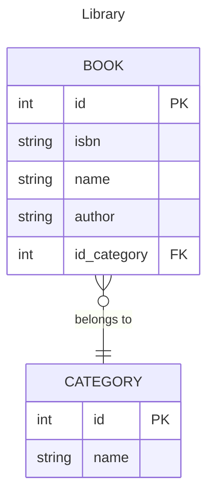

# Library ERD

Database exercise implementing an ERD for library.

```mermaid
---
title: Library
---

erDiagram

BOOK }o--|| CATEGORY : "belongs to"

BOOK {
    int id PK
    string isbn
    string name
    string author

    int id_category FK
}

CATEGORY {
    int id PK
    string name
}
```

## License

[MIT](LICENSE)
